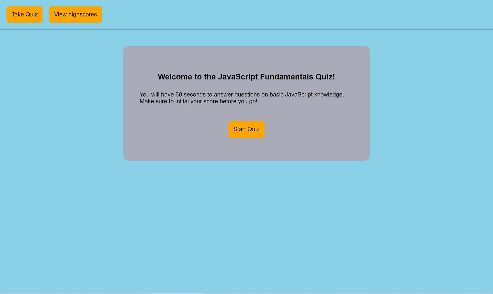

# JavaScript Fundamentals Quiz

## Deployed Link: [https://kkolyvek.github.io/code-quiz/](https://kkolyvek.github.io/code-quiz/)

## Brief Description:

This site allows users to take a timed quiz on some of the basics of JavaScript. The top 10 scores will be saved in the browser's local storage.

## How it Works:

The site has 10 questions on the fundamentals of JavaScript. Once the quiz has begun, the user has 60 seconds to answer the questions that pop up. The questions appear in a random order, and answers appear in a pseudo-random order (the incorrect answers are always in the same order, but the correct answer is injected between them randomly).

At the end of the quiz, when the user submits their initials, the site compares the score to any scores previously saved in the browser's local storage. The top 10 are displayed on the leaderboards page.

## Site Preview:

